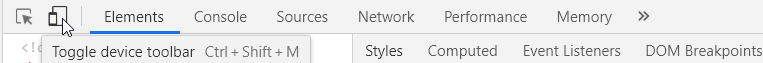

# Тестирование верстки на адаптивность

Проверить верстку на адаптивность можно прямо в браузере \(chrome или firefox\),

1.Зайдите в developer tools \(нажав `f12` или сочетание клавиш `ctrl + shift + i` или `Cmd+Alt+l на Mac`\).

2.Нажмите на иконку мобильного телефона в левом верхнем углу

или нажмите сочетание клавиш `ctrl + shift + m`

1. Выберите модель \(Select a model\) из выпадающего списка заранее установленных режимов, для того чтобы эмулировать определённое устройство

Каждый заранее установленный режим автоматически настраивает параметры эмуляции \(такие как **разрешение экрана устройства** \(device resolution\) и **пиксельное соотношение** \(pixel ratio\), а также включает **эмуляцию сенсорного экрана** \(touch emulation\) и т. д.\).

1. Переключайтесь между **книжным** \(portrait\) и **альбомным** \(landscape\) видом, нажав значок «Изменить размеры». Выберите кнопку «Соответствовать размеру экрана», для того чтобы убедиться, что экран устройства, которое эмулируется, остается полностью видимым внутри окна браузера

1. Для того чтобы эмулировать **пользовательский размер экрана** \(custom screen size\), задайте разрешение экрана устройства в пикселях в полях **ширина** \(width\) и **высота** \(height\):

